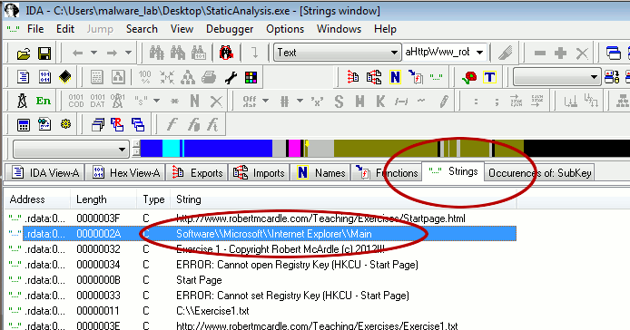
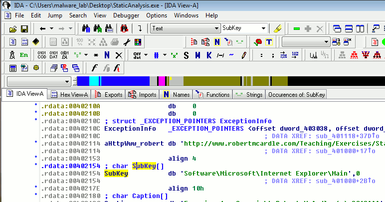
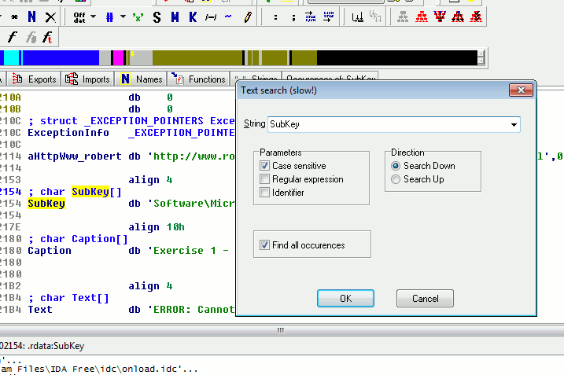
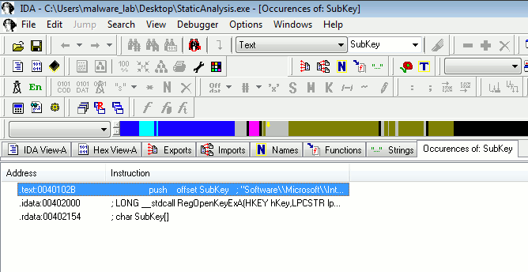
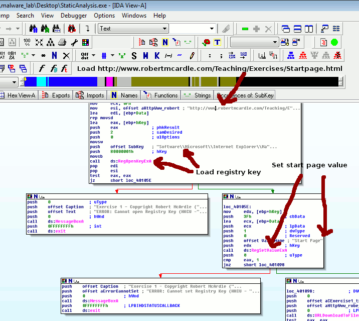

# Static Analysis Lab

## Sample
* StaticAnalysis.zip
* password: novirus

## Unpacked
* StaticAnalysis.exe
* Size: 7680 bytes
* MD5: 8d41684a0c71d43a3abce9165f6a92ec
* SHA1: 3029ea475ba240bec8932527e20083950460c7e3
* SHA256: 47b19a4ee71ef936e2aeede5e64861a467527e4c05c0de695abd968f7d73806c
* PE32 executable (console) Intel 80386, for MS Windows

## Virus Total
* Detection ratio: 45/57
* Results contain:
	* "troj" matched 23 times
	* "pasta" matched 14 times
	* "97CAC90D" matched 8 times
	* "downloader" matched 4 times
	* "cobra" matched 2 times

## Google
* MD5/SHA1:
	* hit on EMSISOFT
		* reported first seen November 10, 2012
		* reported last seen September 28, 2016
* SHA256:
	* no useful hits
* 97CAC90D:
	* no useful hits
* pasta trojan:
	* 375,000 hits
	* Report by [McAfee](https://home.mcafee.com/virusinfo/virusprofile.aspx?key=693822)

## Classification
* Trojan
* Downloader
* Modifies
	* registry keys
	* system files

Could the url of the payload be in the strings?

## Strings
```bash
$ strings StaticAnalysis.exe
```

```
http://www.robertmcardle.com/Teaching/Exercises/Startpage.html
Software\Microsoft\Internet Explorer\Main
Exercise 1 - Copyright Robert McArdle (c) 2012!!!
ERROR: Cannot open Registry Key (HKCU - Start Page)
Start Page
ERROR: Cannot set Registry Key (HKCU - Start Page)
C:\Exercise1.txt
http://www.robertmcardle.com/Teaching/Exercises/Exercise1.txt
ERROR: Cannot Download File
c:\Exercise1.txt
notepad.exe
open
ERROR: Cannot open dropped File
RSDS+4
C:\Users\robert_mcardle\Documents\Personal\CIT\Teaching Modules\Source Code For Exercises\Exercise1\Release\Exercise1.pdb
MessageBoxA
USER32.dll
RegSetValueExA
RegOpenKeyExA
...
```

## Solution Part 1
Open: http://www.robertmcardle.com/Teaching/Exercises/Exercise1.txt

Checked HTTP headers: Nothing

Response: Congratulations - you successfully ran the program, now see if you can figure out what else it does!

From the strings above we guess that the sample will download ```http://www.robertmcardle.com/Teaching/Exercises/Exercise1.txt``` to ```c:\Exercise1.txt``` and the open it in ```notepad.exe```.

## What else is there?

I want that pdb file. Could it be somewhere on the server?

- http://www.robertmcardle.com/Teaching/Exercises
- http://www.robertmcardle.com/Teaching/Exercises/Exercise1.pdb
- http://www.robertmcardle.com/Teaching/Exercises/Release/Exercise1.pdb
- http://www.robertmcardle.com/Teaching/Exercises/Debug/Exercise1.pdb
- http://www.robertmcardle.com/Teaching/Exercises/Exercise1/Exercise1.pdb
- http://www.robertmcardle.com/Teaching/Exercises/Exercise1/Release/Exercise1.pdb
- http://www.robertmcardle.com/Teaching/Exercises/Exercise1/Debug/Exercise1.pdb
- http://www.robertmcardle.com/Teaching/Exercises/Exercise1/Exercise1.sln

Maybe, can't find it easily.

Dead end.

## Solution Part 2

We know it writes a value to the registry:
- at
	- ```Software\Microsoft\Internet Explorer\Main```
- using
	- RegOpenKeyExA
	- RegSetValueExA

But what is the value?

Load into IDA.

Find the registry key string



We have a symbol for it



Find symbol references



Found one in .text - that's code



Analyse graph



From the graph we can see that the sample will set the start page of Internet Explorer to http://www.robertmcardle.com/Teaching/Exercises/Startpage.html

Nothing intereseting on the page itself

## Conclusions
- The sample downloads ```http://www.robertmcardle.com/Teaching/Exercises/Exercise1.txt``` to ```c:\Exercise1.txt``` and the open it in ```notepad.exe```
- The sample sets the start page of Internet Explorer to http://www.robertmcardle.com/Teaching/Exercises/Startpage.html
- The sample uses a win32 message box to alert the user of any failures
- Not very complex and easy to analyse thanks to the debug information

## Afterthoughts
Success! Obtained all the required information without executing the binary.

Had a good idea of what to expect after submitting to virustotal and googling around.

Wasted time looking at the strings in isolation, should have opened IDA earlier.

Wasted time looking for the pdb file, the binary had debug information, should have checked that earlier.

Confirmed my earlier guess at Solution Part 1, later in IDA.